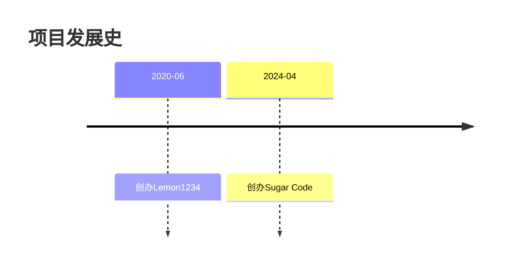

# SugarCode Blog

## 项目介绍

Sugar Code 是我个人静态博客站点。

当前项目中包含了：
* 面试题
* 案例展示
* 干货

虽然项目里面的大分类不多，但是子项很多，如果大家喜欢，可以给一个Star~~~

## 项目历史



从 2020 年 6 月到今天，经历了两个域名、三次版本迭代，从自己开发前后端到现在直接使用 Vitepress 一步到位，可谓是飘忽不定。

但从技术的角度来说，我一直在找寻答案，也许这也不会是我的满意的答卷，但是在找答案的路上，我会一直向前！

## 项目运行

首先保证自己机器 Node.js 版本在 18 及以上！！！

1. 拉取项目

```
git pull https://gitee.com/powerRock/sugarcode-blog.git
```

2. 安装 vitepress

```
npm install vitepress
```

3. 启动服务

```
npm run docs:dev

npx vitepress dev docs
```

4. 项目打包

```
npm run docs:build
```

## 项目贡献

如果您也想来维护 SugarCode，可以按照以下步骤进行操作：

## 即将更新功能
动态定时任务
https://juejin.cn/post/7372377436464660506

自定义注解实现参数校验

对springboot jar 加密

@Primary   @Conditional
https://blog.csdn.net/qq_38923350/article/details/145817846
